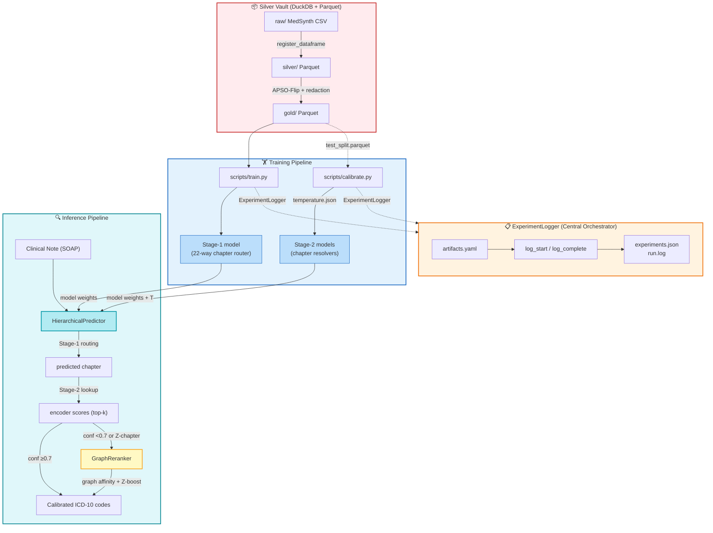

<p align="center">
  
</p>

# Notes to ICD-10

[](https://www.python.org/downloads/)
[](https://opensource.org/licenses/MIT)
[](https://huggingface.co/emilyalsentzer/Bio_ClinicalBERT)
[](https://huggingface.co/datasets/SidneyBishop/notes-to-icd10)
[](https://dvc.org)

Two-stage hierarchical ICD-10 coding from clinical notes using Bio_ClinicalBERT —
**83.9% accuracy across 1,926 ICD-10 codes** from ~4 training examples per code.

---

## 🏆 Results

| Experiment | Architecture | Accuracy | Macro F1 | ECE | Coverage@0.7 |
|---|---|---|---|---|---|
| E-001 | ICD-3 flat, 675 classes | 87.2%* | 0.841 | — | — |
| E-002 | ICD-10 flat, 1,926 classes | 73.3% | 0.634 | — | — |
| E-003 | Hierarchical, cold start Stage-2 | 11.1% | 0.075 | — | — |
| E-009 | Hierarchical, E-002 init (20 epochs) | 79.8% | 0.711 | — | — |
| **E-010** | **Hierarchical, E-002 init (40 epochs)** | **83.9%** | **0.762** | **0.034** | **82.1%** |

*E-001 uses ICD-3 (675 classes), not billable ICD-10 codes — not directly comparable.

**Best model (E-010):** 83.9% top-1 accuracy, 0.762 Macro F1, 98.7% chapter
routing accuracy, 84.8% within-chapter accuracy. Auto-codes 82.1% of cases
at 95.2% accuracy; routes remaining 17.9% to human review.

---

## 🎯 Overview

This project builds an end-to-end pipeline that predicts specific ICD-10
diagnostic codes from APSO-structured clinical notes. The core finding is
that a **two-stage hierarchical architecture with a well-trained E-002
initialiser** substantially outperforms flat ICD-10 classification —
+10.6pp accuracy over the flat baseline on an extremely low-resource task.

### Key Findings

- **Flat ICD-10 classification** (E-002) achieves 73.3% — a strong baseline
  given ~4 training examples per code across 1,926 classes
- **Hierarchical architecture fails without correct initialisation** (E-003,
  11.1%) — training Stage-2 resolvers from scratch is insufficient despite
  a 96.4% accurate Stage-1 router
- **E-002 initialisation fixes Stage-2** (E-009, 79.8%) — pre-learned ICD-10
  representations transfer cleanly to per-chapter resolvers
- **Epoch count matters** (E-010, 83.9%) — 40-epoch E-002 produces richer
  encoder representations than 20-epoch, adding +4.1pp E2E accuracy
- **Z-chapter is the primary remaining gap** — 62.1% E2E (263 codes,
  administrative language with high lexical overlap)

---

## 🏗️ Architecture

The codebase comprises **5 distinct communities** that together form a
complete ML pipeline — from data preparation through inference and
experiment tracking:



### The 5 Communities

**1. Silver Vault (DuckDB + Parquet)** — Declarative data management via
`src/config.py`'s `ArtifactConfig` singleton. Manages the Medallion
architecture: raw CSV → silver Parquet → gold Parquet (APSO-processed),
with full JSONL audit trails and DuckDB queryable metadata.

**2. Training Pipeline** — `scripts/train.py` produces a Stage-1 router
(22-way chapter classification) and per-chapter Stage-2 resolvers. Stage-2
resolvers initialise from the 40-epoch E-002 flat ICD-10 model weights.

**3. Calibration System** — `scripts/calibrate.py` applies temperature
scaling (Guo et al. 2017) to every model, optimising a scalar T via LBFGS
to minimise cross-entropy on held-out test data. Outputs `temperature.json`
per model, read by the predictor at runtime.

**4. Inference Pipeline** — `src/inference.py`'s `HierarchicalPredictor`
loads Stage-1 + all Stage-2 models with calibration temperatures. Routes
each note through the two-stage pipeline, applying `T`-scaled softmax.

**5. GraphReranker** — `src/graph_reranker.py` activates when Stage-2
top confidence < 0.7 or the predicted chapter is "Z". Uses a knowledge
graph (ICD-10 ↔ UMLS concept associations) plus a Z-code phrase dictionary
to compute affinity scores and re-rank candidates.

**ExperimentLogger** (`src/experiment_logger.py`) serves as the central
orchestrator across all communities: it tracks experiment state, logs
stage completions with artifacts and parameters, and maintains a machine-readable
registry at `outputs/experiments.json`.

---

## 🔒 Reproducibility: DVC + Hugging Face

This project made an explicit architectural decision in Phase 1b (May 2026) to **eliminate external data drift** by locking all canonical datasets to Hugging Face Hub and versioning all derived artifacts with DVC.

### The Problem We Solved

Initial versions pulled ICD-10 codes directly from CDC FTP and CMS sources at runtime. This created three critical risks:
1. **Non-reproducibility** — CDC updates codes annually (FY2026 → FY2027 changes ~400 codes)
2. **Build fragility** — FTP outages and rate limits broke `prepare_data.py` unpredictably
3. **Audit failure** — no cryptographic provenance for regulatory or research review

### Our Solution: Three-Layer Locking

**Layer 1 — Hugging Face Hub (Canonical Sources)**
- All source data now lives at [`SidneyBishop/notes-to-icd10`](https://huggingface.co/datasets/SidneyBishop/notes-to-icd10)
- `scripts/prepare_data.py` was refactored to use `hf_hub_download()` instead of FTP:
  ```python
  hf_hub_download(repo_id="SidneyBishop/notes-to-icd10", filename="icd10_notes.parquet")
  hf_hub_download(repo_id="SidneyBishop/notes-to-icd10", filename="cdc_fy2026_icd10.parquet")
  ```
- Immutable, versioned, and publicly accessible — anyone cloning the repo gets byte-identical inputs on first run

**Layer 2 — DVC (Derived Artifacts)**
- Large binary artifacts (gold Parquet ~63MB, model weights ~1.5GB) are tracked by DVC, not git
- Workflow: `dvc add data/gold/medsynth_gold_apso_*.parquet` → creates lightweight `.dvc` pointer file
- `dvc push` uploads to remote storage; `dvc pull` restores exact bytes
- Git tracks only `.dvc` files and manifests, keeping repository <50MB

**Layer 3 — Phase 4 Manifest (Cryptographic Proof)**
- `scripts/generate_manifest.py` creates `data/gold/MANIFEST_*.json` with:
  - SHA256 hashes for every input and output file
  - Exact row counts and CDC validation split
  - Git commit hash and UTC timestamp
  - Full Polars schema

Current locked gold (commit 6dda8ac, tag v0.1.0-phase1b-locked):
- **gold_parquet**: `220dafcfe6a8aa53c0a728dbf3537ed1407897f2c92050831c7ebb31c7218bc7` (10,240 rows, 63.5 MB)
- **medsynth source**: `7fa03f67b113b57a5f17349c712946553b4b186e1a11f39d74e0821d02fc5ac8`
- **cdc_fy2026**: `2433adf954c3f49296a40761b83afb98c2d61cd78ca43f335fbdd4167e5fb93d` (74,719 codes)
- **validation split**: 9,660 billable / 495 invalid / 60 non_billable_parent / 25 placeholder_x

### Decision Rationale

We chose HF Hub over raw git-LFS because:
- HF provides built-in dataset versioning and CDN distribution
- `datasets.load_dataset()` integration for notebooks
- Public discoverability for research reproducibility

We chose DVC over git-LFS because:
- DVC supports multiple remotes (S3, GDrive, SSH) without GitHub LFS quotas
- `.dvc` files are human-readable YAML, enabling code review of data changes
- Pipeline-aware caching prevents redundant recomputation

### Fresh Clone Test

Cloning and running from scratch works without any external CDC dependencies:
```bash
git clone https://github.com/Sidney-Bishop/notes-to-icd10.git /tmp/test
cd /tmp/test
uv sync

# Option A: restore from DVC remote (fast, requires configured remote)
uv run dvc remote modify --local localstore url /path/to/your/dvcstore
uv run dvc pull

# Option B: rebuild from HF Hub (slower, works on any machine)
uv run python scripts/prepare_data.py
```
Both paths produce byte-identical gold data validated against the committed
SHA256 manifest, with zero calls to CDC FTP infrastructure.

---


---

## 🚀 Quick Start

### Prerequisites

- Python 3.12
- [uv](https://docs.astral.sh/uv/getting-started/installation/) — fast Python package manager (`pip install uv` or `brew install uv`)
- Apple Silicon Mac (MPS acceleration) or CUDA GPU
- **~20GB disk space** for the current best models (E-003 + E-010)
- **~800GB** if running the full training pipeline from scratch (checkpoints accumulate ~75GB per experiment — run `scripts/cleanup.py` after each run)
- ~16GB RAM minimum, 32GB+ recommended

### Installation

```bash
# 1. Clone and install dependencies
git clone https://github.com/Sidney-Bishop/notes-to-icd10.git
cd notes-to-icd10
uv sync

# 2. Run the pre-flight check to confirm everything is wired up correctly
uv run python verify_scripts.py

# 3. Configure your local DVC remote (one-time setup)
#    Replace the path with wherever you want to store large binary artifacts
uv run dvc remote modify --local localstore url /path/to/your/dvcstore

# 4. Pull tracked data artifacts from the DVC remote
uv run dvc pull
#    If the remote is not yet populated (fresh setup), run the pipeline instead:
#    uv run python scripts/prepare_data.py
#    This downloads source data from HF Hub, validates SHA256, and builds the gold layer.
```

> **Note on disk space:** Training checkpoints accumulate ~3.6GB per resolver.
> After each training run, reclaim space with:
> ```bash
> uv run python scripts/cleanup.py --dry-run  # preview
> uv run python scripts/cleanup.py            # delete checkpoints, keep models
> ```

### Dataset
```python
from datasets import load_dataset
# Canonical HF-locked dataset (MedSynth + CDC FY2026)
dataset = load_dataset("SidneyBishop/notes-to-icd10")
# Contains: icd10_notes (10,240 rows) and cdc_fy2026_icd10 (74,719 codes)
```

### Run the Pipeline

Run notebooks in order:
```bash
uv run jupyter notebook
```

| Notebook | Experiment | Runtime |
|---|---|---|
| `01-EDA_SOAP.ipynb` | Gold layer generation | ~15 min |
| `02-Model_ClinicalBERT_Baseline_ICD3.ipynb` | E-001 ICD-3 baseline | ~2.5 hrs |
| `03-Model_ClinicalBERT_Surgical_ICD10.ipynb` | E-002 flat ICD-10 (40 epochs) | ~4 hrs |
| `04-Model_Hierarchical_ICD10.ipynb` | E-003 hierarchical cold start | ~2 hrs |
| `05-Model_Hierarchical_ICD10_E002Init.ipynb` | E-010 best model | ~2 hrs |

Total training time: approximately 11–12 hours on Apple M5 Max.

Or run end-to-end via scripts — see `Run_notes.md` for the complete
step-by-step guide including verification commands at each stage.

### Inference
```python
from src.inference import HierarchicalPredictor

predictor = HierarchicalPredictor(
    experiment_name='E-010_40ep_E002Init',
    stage1_experiment='E-003_Stage1_Router',
)

note = """
Assessment: Type 2 diabetes mellitus with hyperglycaemia.
Plan: Adjust metformin dosage, HbA1c recheck in 3 months.
Subjective: Patient reports increased thirst and frequent urination.
Objective: Fasting glucose 14.2 mmol/L, BMI 31.
"""

result = predictor.predict(note, top_k=5)
print(f"Top prediction: {result['codes'][0]} ({result['scores'][0]:.1%})")
# Top prediction: E11.65 (84.2%)
```

### Experiment Tracking
```bash
mlflow ui --backend-store-uri sqlite:///mlflow.db --port 5001
```

---

## 📁 Project Structure
```text
notes-to-icd10/
├── data/
│   ├── cache/              # HuggingFace model cache (gitignored)
│   ├── gold/               # Gold layer Parquet — APSO-processed
│   │   ├── *.parquet.dvc   # DVC pointers (tracked)
│   │   └── MANIFEST_*.json # SHA256 manifests (tracked)
│   ├── medsynth/           # HF-downloaded source (gitignored)
│   ├── ontology/           # ICD-10 ↔ UMLS knowledge graph data
│   └── raw/                # Original sources (gitignored)
├── notebooks/
│   ├── 01-EDA_SOAP.ipynb
│   ├── 02-Model_ClinicalBERT_Baseline_ICD3.ipynb
│   ├── 03-Model_ClinicalBERT_Surgical_ICD10.ipynb
│   ├── 04-Model_Hierarchical_ICD10.ipynb
│   ├── 05-Model_Hierarchical_ICD10_E002Init.ipynb
│   └── Notebook_pipline_Overview.md
├── outputs/
│   └── evaluations/
│       ├── registry/       # Promoted model artifacts (gitignored)
│       └── E-00*/          # Per-experiment training artifacts (gitignored)
├── scripts/
│   ├── prepare_data.py       # HF-locked ingestion + CDC validation
│   ├── generate_manifest.py  # Phase 4 SHA256 manifest generator
│   ├── train.py            # Flat and hierarchical training
│   ├── calibrate.py        # Temperature scaling
│   ├── evaluate.py         # Full evaluation suite
│   ├── predict.py          # Single-note inference
│   └── prepare_splits.py   # Deterministic train/val/test splits
├── src/
│   ├── config.py           # Centralised configuration + audit trail
│   ├── experiment_logger.py # Structured experiment registry
│   ├── graph_reranker.py   # ICD-10 knowledge graph reranker
│   ├── inference.py        # End-to-end pipeline inference
│   ├── paths.py            # Canonical path resolution
│   ├── plot_utils.py       # Figure persistence
│   └── evaluation.py       # Metrics: Macro F1, Accuracy, Top-5
├── upload_to_hf.py         # Utility to push canonical data to HF Hub
├── Run notes.md            # Step-by-step script pipeline guide
├── REFACTORING_PLAN.md     # Development roadmap and status
├── verify_scripts.py       # Pre-flight health checks
├── artifacts.yaml          # Centralised experiment configuration
├── pyproject.toml          # uv-managed dependencies
└── uv.lock
```

---

## 🔬 Methodology

### Zero-Trust Ingestion
Every record is validated against a Pydantic schema before entering
the pipeline — catching empty notes, malformed ICD-10 codes, and label
inconsistencies at ingestion time. **As of Phase 1b, all sources are locked
to Hugging Face Hub (`SidneyBishop/notes-to-icd10`) rather than live CDC FTP feeds,**
ensuring byte-identical reproduction across environments.

### CDC FY2026 Validation
Phase 1b validates all 10,240 codes against the canonical FY2026 ICD-10-CM
table (74,719 codes) downloaded from HF Hub. Results are frozen in the manifest:
- **billable** (9,660): Valid leaf codes suitable for billing
- **invalid_or_malformed** (495): Not present in FY2026
- **non_billable_parent** (60): Chapter/category headers (e.g., "E11")
- **placeholder_x** (25): Codes requiring 7th character extension

### APSO-Flip Preprocessing
Clinical notes are restructured so the Assessment section appears at
Token 0, preventing diagnostic evidence from being truncated by
Bio_ClinicalBERT's 512-token context window. ICD-10 strings are
redacted from note text to prevent label leakage.

### Hierarchical Decomposition
The two-stage pipeline decomposes 1,926-way ICD-10 classification into
a 22-way chapter routing problem followed by within-chapter resolution,
reducing the effective label space per resolver from 1,926 to ~100.

### Transfer Learning Chain
Each stage initialises from the best available prior model:
`Bio_ClinicalBERT → E-002 (40-epoch flat ICD-10) → E-010 Stage-2 resolvers`.
This accumulates ICD-10 knowledge across experiments. The epoch count of
E-002 is critical — 40 epochs produces substantially richer representations
than 20 epochs (+4.1pp E2E accuracy on Stage-2 resolvers).

---

## ⚠️ Limitations

- **Synthetic dataset:** MedSynth uses uniform sampling (5 records per
  ICD-10 code). Real clinical code distributions are heavily skewed —
  performance on real data will differ.
- **Low-resource constraint:** ~4 training examples per ICD-10 code is
  an extremely challenging regime. Results reflect the limits of this
  constraint rather than the architecture ceiling.
- **Z-chapter difficulty:** Administrative codes (Z-chapter, 263 classes)
  achieve 62.1% E2E accuracy due to highly similar clinical language
  across codes. This is the primary remaining improvement target.
- **Apple Silicon tested:** Training was conducted on Apple M5 Max with
  MPS. CUDA compatibility is expected but untested.

---

## 📦 Dependencies

All dependencies managed via `pyproject.toml` and `uv.lock`:
```bash
uv sync  # installs everything
```

Key libraries: `transformers`, `torch`, `polars`, `mlflow`, `pydantic`,
`scikit-learn`, `datasets`, `huggingface-hub`, `dvc`

---

## 📄 Citation

If you use this work, please cite:

**MedSynth dataset:**
```bibtex
@misc{rezaie2025medsynth,
  title   = {MedSynth: Synthetic Medical Dialogue Dataset for ICD-10 Coding},
  author  = {Rezaie Mianroodi, et al.},
  year    = {2025},
  url     = {https://arxiv.org/abs/2508.01401}
}
```

**Canonical HF dataset (this repo):**
```bibtex
@dataset{bishop2026notestoicd10,
  title = {notes-to-icd10: HF-locked MedSynth + CDC FY2026},
  author = {Bishop, Sidney and Roche, Jason},
  year = {2026},
  url = {https://huggingface.co/datasets/SidneyBishop/notes-to-icd10}
}
```

---

## 💬 Issues & Suggestions

This is a personal research project. Issues and suggestions are welcome
via [GitHub Issues](https://github.com/Sidney-Bishop/notes-to-icd10/issues).

---

## 📝 License

MIT License — see [LICENSE](LICENSE) for details.

Copyright (c) 2026 Jason Roche