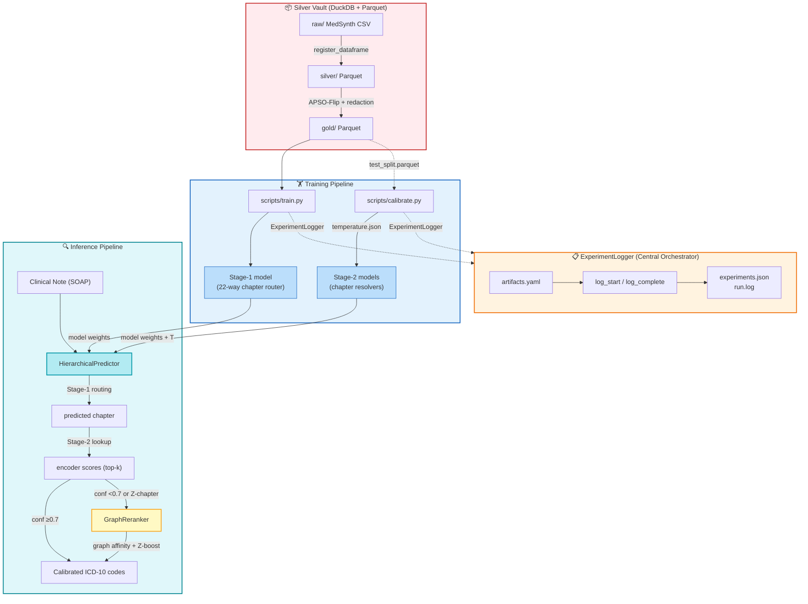

<p align="center">
  
</p>

# Notes to ICD-10

[](https://www.python.org/downloads/)
[](https://opensource.org/licenses/MIT)
[](https://huggingface.co/emilyalsentzer/Bio_ClinicalBERT)
[](https://huggingface.co/datasets/Ahmad0067/MedSynth)

Two-stage hierarchical ICD-10 coding from clinical notes using Bio_ClinicalBERT —
**79.8% accuracy across 1,926 ICD-10 codes** from ~4 training examples per code.

---

## 🏆 Results

| Experiment | Architecture | Accuracy | Macro F1 |
|---|---|---|---|
| E-001 | ICD-3 flat, 675 classes | 87.2% | 0.841 |
| E-002 | ICD-10 flat, 1,926 classes | 73.3% | 0.634 |
| E-003 | Hierarchical, cold start Stage-2 | 11.1% | 0.075 |
| **E-009** | **Hierarchical, E-002 init Stage-2** | **79.8%** | **0.711** |

**Best model (E-009):** 79.8% top-1 accuracy, 0.711 Macro F1;
96.4% chapter routing accuracy, 82.8% within-chapter accuracy.

---

## 🎯 Overview

This project builds an end-to-end pipeline that predicts specific ICD-10
diagnostic codes from APSO-structured clinical notes. The core finding is
that a **two-stage hierarchical architecture with E-002 initialisation**
substantially outperforms flat ICD-10 classification —
+6.5pp accuracy over the flat baseline on an extremely low-resource task.

### Key Findings

- **Flat ICD-10 classification** (E-002) achieves 73.3% — a strong baseline
  given ~4 training examples per code across 1,926 classes
- **Hierarchical architecture fails without correct initialisation** (E-003,
  11.1%) — training Stage-2 resolvers from scratch on chapter-filtered
  subsets is insufficient despite an accurate Stage-1 router (96.4%)
- **E-002 initialisation fixes Stage-2** (E-009, 79.8%) — fine-tuning
  existing ICD-10 representations rather than learning from scratch produces
  a 7.2× within-chapter accuracy improvement (11.5% → 82.8%)
- **Within-chapter accuracy of 82.8% exceeds the 80.4% target** needed to
  outperform the flat baseline end-to-end

---

## 🏗️ Architecture

The codebase comprises **5 distinct communities** that together form a
complete ML pipeline — from data preparation through inference and
experiment tracking:



### The 5 Communities

**1. Silver Vault (DuckDB + Parquet)** — Declarative data management via
`src/config.py`'s `ArtifactConfig` singleton. Manages the Medallion
architecture: raw CSV → silver Parquet → gold Parquet (APSO-processed),
with full JSONL audit trails and DuckDB queryable metadata.

**2. Training Pipeline** — `scripts/train.py` produces a Stage-1 router
(22-way chapter classification) and per-chapter Stage-2 resolvers. Stage-1
uses a general-purpose encoder; Stage-2 resolvers initialise from the E-002
flat ICD-10 model weights for maximum representation transfer.

**3. Calibration System** — `scripts/calibrate.py` applies temperature
scaling (Guo et al. 2017) to every model, optimising a scalar T via LBFGS
to minimise cross-entropy on held-out test data. Outputs `temperature.json`
per model, read by the predictor at runtime.

**4. Inference Pipeline** — `src/inference.py`'s `HierarchicalPredictor`
loads Stage-1 + all Stage-2 models with calibration temperatures. Routes
each note through the two-stage pipeline, applying `T`-scaled softmax.

**5. GraphReranker** — `src/graph_reranker.py` activates when Stage-2
top confidence < 0.7 or the predicted chapter is "Z". Uses a knowledge
graph (ICD-10 ↔ UMLS concept associations) plus a Z-code phrase dictionary
to compute affinity scores and re-rank candidates.

**ExperimentLogger** (`src/experiment_logger.py`) serves as the central
orchestrator across all communities: it tracks experiment state, logs
stage completions with artifacts and parameters, and maintains a machine-readable
registry at `outputs/experiments.json`.

---

## 🚀 Quick Start

### Prerequisites

- Python 3.11
- Apple Silicon Mac (MPS acceleration) or CUDA GPU
- ~50GB disk space for models and data
- ~16GB RAM minimum, 32GB+ recommended

### Installation
```bash
git clone https://github.com/Sidney-Bishop/notes-to-icd10.git
cd notes-to-icd10
uv sync
```

### Dataset
```python
from datasets import load_dataset
dataset = load_dataset("Ahmad0067/MedSynth")
```

### Run the Pipeline

Run notebooks in order:
```bash
uv run jupyter notebook
```

| Notebook | Experiment | Runtime |
|---|---|---|
| `01-EDA_SOAP.ipynb` | Gold layer generation | ~15 min |
| `02-Model_ClinicalBERT_Baseline_ICD3.ipynb` | E-001 ICD-3 baseline | ~2.5 hrs |
| `03-Model_ClinicalBERT_Surgical_ICD10.ipynb` | E-002 flat ICD-10 | ~4 hrs |
| `04-Model_Hierarchical_ICD10.ipynb` | E-003 hierarchical cold start | ~2 hrs |
| `05-Model_Hierarchical_ICD10_E002Init.ipynb` | E-009 best model | ~2 hrs |

Total training time: approximately 11–12 hours on Apple M5 Max.

Or run end-to-end via scripts — see `Run notes.md` for the complete
step-by-step guide including verification commands at each stage.

### Inference
```python
from src.inference import HierarchicalPredictor

predictor = HierarchicalPredictor(
    experiment_name='E-009_Balanced_E002Init',
    stage1_experiment='E-003_Stage1_Router',
)

note = """
Assessment: Type 2 diabetes mellitus with hyperglycaemia.
Plan: Adjust metformin dosage, HbA1c recheck in 3 months.
Subjective: Patient reports increased thirst and frequent urination.
Objective: Fasting glucose 14.2 mmol/L, BMI 31.
"""

result = predictor.predict(note, top_k=5)
print(f"Top prediction: {result['codes'][0]} ({result['scores'][0]:.1%})")
# Top prediction: E11.65 (84.2%)
```

### Experiment Tracking
```bash
mlflow ui --backend-store-uri sqlite:///mlflow.db --port 5001
```

---

## 📁 Project Structure
```text
notes-to-icd10/
├── data/
│   ├── cache/              # HuggingFace model cache (gitignored)
│   ├── gold/               # Gold layer Parquet — APSO-processed
│   ├── ontology/           # ICD-10 ↔ UMLS knowledge graph data
│   └── raw/                # Original MedSynth CSV (gitignored)
├── notebooks/
│   ├── 01-EDA_SOAP.ipynb
│   ├── 02-Model_ClinicalBERT_Baseline_ICD3.ipynb
│   ├── 03-Model_ClinicalBERT_Surgical_ICD10.ipynb
│   ├── 04-Model_Hierarchical_ICD10.ipynb
│   ├── 05-Model_Hierarchical_ICD10_E002Init.ipynb
│   └── Notebook_pipline_Overview.md
├── outputs/
│   └── evaluations/
│       ├── registry/       # Promoted model artifacts (gitignored)
│       └── E-00*/          # Per-experiment training artifacts (gitignored)
├── scripts/
│   ├── train.py            # Flat and hierarchical training
│   ├── calibrate.py        # Temperature scaling
│   ├── evaluate.py         # Full evaluation suite
│   ├── predict.py          # Single-note inference
│   └── prepare_splits.py   # Deterministic train/val/test splits
├── src/
│   ├── config.py           # Centralised configuration + audit trail
│   ├── experiment_logger.py # Structured experiment registry
│   ├── graph_reranker.py   # ICD-10 knowledge graph reranker
│   ├── inference.py        # End-to-end pipeline inference
│   ├── paths.py            # Canonical path resolution
│   ├── plot_utils.py       # Figure persistence (R-003)
│   └── evaluation.py       # Metrics: Macro F1, Accuracy, Top-5
├── Run notes.md            # Step-by-step script pipeline guide
├── REFACTORING_PLAN.md     # Development roadmap and status
├── verify_scripts.py       # Pre-flight health checks
├── artifacts.yaml          # Centralised experiment configuration
├── pyproject.toml          # uv-managed dependencies
└── uv.lock
```

---

## 🔬 Methodology

### Zero-Trust Ingestion
Every record is validated against a Pydantic schema before entering
the pipeline — catching empty notes, malformed ICD-10 codes, and label
inconsistencies at ingestion time.

### APSO-Flip Preprocessing
Clinical notes are restructured so the Assessment section appears at
Token 0, preventing diagnostic evidence from being truncated by
Bio_ClinicalBERT's 512-token context window. ICD-10 strings are
redacted from note text to prevent label leakage.

### Hierarchical Decomposition
The two-stage pipeline decomposes 1,926-way ICD-10 classification into
a 22-way chapter routing problem followed by within-chapter resolution,
reducing the effective label space per resolver from 1,926 to ~100.

### Transfer Learning Chain
Each stage initialises from the best available prior model — creating a
progressive transfer learning chain: base Bio_ClinicalBERT → E-002 flat
ICD-10 → E-009 per-chapter resolvers. This accumulates ICD-10 knowledge
across experiments rather than relearning from scratch at each stage.

---

## ⚠️ Limitations

- **Synthetic dataset:** MedSynth uses uniform sampling (5 records per
  ICD-10 code). Real clinical code distributions are heavily skewed —
  performance on real data will differ.
- **Low-resource constraint:** ~4 training examples per ICD-10 code is
  an extremely challenging regime. Results reflect the limits of this
  constraint rather than the architecture ceiling.
- **Z-chapter difficulty:** Administrative codes (Z-chapter, 263 classes)
  achieve only 52.9% E2E accuracy due to highly similar clinical language
  across codes. This is the primary remaining improvement target.
- **Apple Silicon tested:** Training was conducted on Apple M5 Max with
  MPS. CUDA compatibility is expected but untested.

---

## 📦 Dependencies

All dependencies managed via `pyproject.toml` and `uv.lock`:
```bash
uv sync  # installs everything
```

Key libraries: `transformers`, `torch`, `polars`, `mlflow`, `pydantic`,
`scikit-learn`, `datasets`, `huggingface-hub`

---

## 📄 Citation

If you use this work, please cite the MedSynth dataset:
```bibtex
@misc{rezaie2025medsynth,
  title   = {MedSynth: Synthetic Medical Dialogue Dataset for ICD-10 Coding},
  author  = {Rezaie Mianroodi, et al.},
  year    = {2025},
  url     = {https://arxiv.org/abs/2508.01401}
}
```

---

## 💬 Issues & Suggestions

This is a personal research project. Issues and suggestions are welcome
via [GitHub Issues](https://github.com/Sidney-Bishop/notes-to-icd10/issues).

---

## 📝 License

MIT License — see [LICENSE](LICENSE) for details.

Copyright (c) 2026 Jason Roche