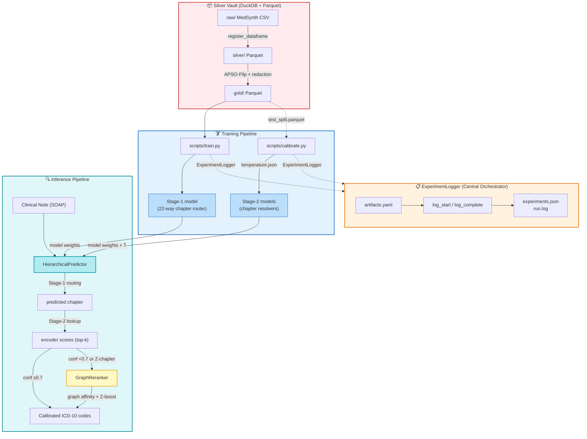
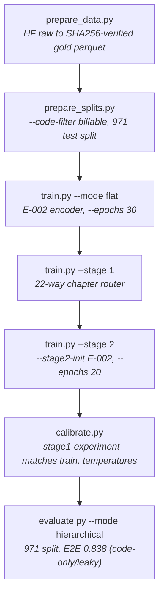

<p align="center">
  
</p>

# Notes to ICD-10

[](https://www.python.org/downloads/)
[](https://opensource.org/licenses/MIT)
[](https://huggingface.co/emilyalsentzer/Bio_ClinicalBERT)
[](https://huggingface.co/datasets/SidneyBishop/notes-to-icd10)
[](https://dvc.org)

Two-stage hierarchical ICD-10 coding from clinical notes using Bio_ClinicalBERT.
**End-to-end accuracy is 56.7% on the de-leaked dataset**, compared with 84.9% when
only the ICD-10 code is redacted and the diagnosis description is left in the note.
The 28.2-point gap is diagnosis-description leakage, measured directly by running the
same pipeline end-to-end under both redaction regimes (see Results).

---

## 🏆 Results

The headline question for this dataset is how much the apparent accuracy depends on
diagnosis text that leaks the answer. We measured it directly: the same two-stage
pipeline, trained and evaluated end-to-end, under two redaction regimes that differ
**only** in how much is removed from the note's Assessment section.

| Redaction regime | Run | E2E Acc | Macro F1 | ECE | Cov@0.7 |
|---|---|---|---|---|---|
| **1. Code-only** (ICD-10 code removed, diagnosis description left in) | E-009 | **84.9%** | 0.774 | 0.024 | 81.2% |
| **2. Code + description** (ICD-10 code *and* its associated diagnosis text removed) | E-016 | **56.7%** | 0.446 | 0.070 | 48.2% |

Both runs are full end-to-end rebuilds (Stage-1 router + Stage-2 resolvers trained and
evaluated on the same gold), Bio_ClinicalBERT, 20 epochs, seed 42, billable codes,
E-002 Stage-2 initialisation, threshold 0.7. The only difference is the redaction
depth of the training/eval data.

**Reading the result:** removing the diagnosis description — the human-readable text
that names the condition the ICD-10 code stands for — drops end-to-end accuracy from
84.9% to 56.7%, a 28.2-point absolute fall (≈33% relative). Regime 1 (84.9%) measures
the pipeline on notes where the answer is usually spelled out in the Assessment text;
regime 2 (56.7%) measures it on notes where that text has been removed, so the model
must work from the surrounding clinical findings. Regime 2 reflects the task as
intended.

*Caveat:* the de-leaked gold used for regime 2 still carries ~18.6% residual
description leakage (some phrasings are not caught by the deterministic redactor), so
56.7% is a slight over-estimate of a perfectly-clean ceiling, not an under-estimate.

### Architecture ablation (code-only regime)

These earlier results established the architecture and all share regime 1 (code-only
redaction); they are not directly comparable to the de-leaked 56.7% above.

| Experiment | Architecture | Accuracy | Macro F1 |
|---|---|---|---|
| E-001 | ICD-3 flat, 675 classes | 87.6%* | 0.8456 |
| E-002 | ICD-10 flat, 1,926 classes | 73.0% | 0.626 |
| E-003 | Hierarchical, cold start Stage-2 | 12.7% | 0.083 |
| E-009 | Hierarchical, E-002 init (20 epochs) | 84.9% | 0.774 |

*E-001 uses ICD-3 (675 classes), not billable ICD-10 codes — not directly comparable.

---

## 🎯 Overview

This project builds an end-to-end pipeline that predicts specific ICD-10
diagnostic codes from APSO-structured clinical notes. The core finding is
that a **two-stage hierarchical architecture with a well-trained E-002
initialiser** substantially outperforms flat ICD-10 classification —
+10.9pp accuracy over the flat baseline on an extremely low-resource task.

### Key Findings

- **Diagnosis-description leakage dominates the apparent accuracy** — the same
  end-to-end pipeline scores 84.9% with the diagnosis description left in the note
  and 56.7% with it removed. The 28.2-point gap is leakage, not capability.
- **Flat ICD-10 classification** (E-002) achieves 73.0% (code-only regime) — a strong
  baseline given ~4 training examples per code across 1,926 classes
- **Hierarchical architecture fails without correct initialisation** (E-003,
  12.7%) — training Stage-2 resolvers from scratch is insufficient despite
  a 96.3% accurate Stage-1 router
- **E-002 initialisation fixes Stage-2** (E-009) — pre-learned ICD-10
  representations transfer cleanly to per-chapter resolvers
- **Z-chapter is the primary remaining gap** — 58.3% E2E in the de-leaked regime
  (263 codes, administrative language with high lexical overlap)

---

## 🏗️ Architecture

The codebase comprises **5 distinct communities** that together form a
complete ML pipeline — from data preparation through inference and
experiment tracking:


```mermaid
flowchart TB
    %% --- Silver Vault (red community in graphify) ---
    subgraph SV["📦 Silver Vault (DuckDB + Parquet)"]
        direction TB
        RAW["raw/ MedSynth CSV"]
        SIL["silver/ Parquet"]
        GOLD["gold/ Parquet"]
        RAW -->|register_dataframe| SIL -->|APSO-Flip + redaction| GOLD
    end

    %% --- Training (blue) ---
    subgraph TR["🏋️ Training Pipeline"]
        direction LR
        TRAIN["scripts/train.py"]
        CAL["scripts/calibrate.py"]
        S1["Stage-1 model<br/>(22-way chapter router)"]
        S2["Stage-2 models<br/>(chapter resolvers)"]
        TRAIN --> S1
        CAL -->|temperature.json| S2
    end

    %% --- Inference (teal + yellow) ---
    subgraph INF["🔍 Inference Pipeline"]
        direction LR
        NOTE["Clinical Note (SOAP)"] --> HP["HierarchicalPredictor"]
        HP -->|Stage-1 routing| CHAP["predicted chapter"]
        CHAP -->|Stage-2 lookup| ENC["encoder scores (top-k)"]
        ENC -->|conf ≥0.7| OUT["Calibrated ICD-10 codes"]
        ENC -->|conf <0.7 or Z-chapter| GR["GraphReranker"]
        GR -->|graph affinity + Z-boost| OUT
    end

    %% --- ExperimentLogger (orange hub) ---
    subgraph LOG["📋 ExperimentLogger (Central Orchestrator)"]
        direction LR
        CFG["artifacts.yaml"] --> LOGN["log_start / log_complete"] --> REG["experiments.json<br/>run.log"]
    end

    %% --- Data flow ---
    GOLD --> TRAIN
    GOLD -.->|test_split.parquet| CAL
    S1 -->|model weights| HP
    S2 -->|model weights + T| HP
    TRAIN -.->|ExperimentLogger| LOG
    CAL -.->|ExperimentLogger| LOG

    %% --- Colors matching graphify ---
    style SV fill:#ffebee,stroke:#c62828,stroke-width:2px
    style TR fill:#e3f2fd,stroke:#1565c0,stroke-width:2px
    style INF fill:#e0f7fa,stroke:#00838f,stroke-width:2px
    style LOG fill:#fff3e0,stroke:#ef6c00,stroke-width:2px
    style HP fill:#b2ebf2,stroke:#0097a7,stroke-width:2px
    style GR fill:#fff9c4,stroke:#f9a825,stroke-width:2px
    style S1 fill:#bbdefb,stroke:#1565c0
    style S2 fill:#bbdefb,stroke:#1565c0
```

### The 5 Communities

**1. Silver Vault (DuckDB + Parquet)** — Declarative data management via
`src/config.py`'s `ArtifactConfig` singleton. Manages the Medallion
architecture: raw CSV → silver Parquet → gold Parquet (APSO-processed),
with full JSONL audit trails and DuckDB queryable metadata.

**2. Training Pipeline** — `scripts/train.py` produces a Stage-1 router
(22-way chapter classification) and per-chapter Stage-2 resolvers. Stage-2
resolvers initialise from the 40-epoch E-002 flat ICD-10 model weights.

**3. Calibration System** — `scripts/calibrate.py` applies temperature
scaling (Guo et al. 2017) to every model, optimising a scalar T via LBFGS
to minimise cross-entropy on held-out test data. Outputs `temperature.json`
per model, read by the predictor at runtime.

**4. Inference Pipeline** — `src/inference.py`'s `HierarchicalPredictor`
loads Stage-1 + all Stage-2 models with calibration temperatures. Routes
each note through the two-stage pipeline, applying `T`-scaled softmax.

**5. GraphReranker** — `src/graph_reranker.py` activates when Stage-2
top confidence < 0.7 or the predicted chapter is "Z". Uses a knowledge
graph (ICD-10 ↔ UMLS concept associations) plus a Z-code phrase dictionary
to compute affinity scores and re-rank candidates.

**ExperimentLogger** (`src/experiment_logger.py`) serves as the central
orchestrator across all communities: it tracks experiment state, logs
stage completions with artifacts and parameters, and maintains a machine-readable
registry at `outputs/experiments.json`.

---

## 🔒 Reproducibility: DVC + Hugging Face

This project made an explicit architectural decision in Phase 1b (May 2026) to **eliminate external data drift** by locking all canonical datasets to Hugging Face Hub and versioning all derived artifacts with DVC.

### The Problem We Solved

Initial versions pulled ICD-10 codes directly from CDC FTP and CMS sources at runtime. This created three critical risks:
1. **Non-reproducibility** — CDC updates codes annually (FY2026 → FY2027 changes ~400 codes)
2. **Build fragility** — FTP outages and rate limits broke `prepare_data.py` unpredictably
3. **Audit failure** — no cryptographic provenance for regulatory or research review

### Our Solution: Three-Layer Locking

**Layer 1 — Hugging Face Hub (Canonical Sources)**
- All source data now lives at [`SidneyBishop/notes-to-icd10`](https://huggingface.co/datasets/SidneyBishop/notes-to-icd10)
- `scripts/prepare_data.py` was refactored to use `hf_hub_download()` instead of FTP:
  ```python
  hf_hub_download(repo_id="SidneyBishop/notes-to-icd10", filename="icd10_notes.parquet")
  hf_hub_download(repo_id="SidneyBishop/notes-to-icd10", filename="cdc_fy2026_icd10.parquet")
  ```
- Immutable, versioned, and publicly accessible — anyone cloning the repo gets byte-identical inputs on first run

**Layer 2 — DVC (Derived Artifacts)**
- Large binary artifacts (gold Parquet ~63MB, model weights ~1.5GB) are tracked by DVC, not git
- Workflow: `dvc add data/gold/medsynth_gold_apso.parquet` → creates lightweight `.dvc` pointer file
- `dvc push` uploads to remote storage; `dvc pull` restores exact bytes
- Git tracks only `.dvc` files and manifests, keeping repository <50MB

**Layer 3 — Phase 4 Manifest (Cryptographic Proof)**
- `scripts/generate_manifest.py` creates `data/gold/MANIFEST_*.json` with:
  - SHA256 hashes for every input and output file
  - Exact row counts and CDC validation split
  - Git commit hash and UTC timestamp
  - Full Polars schema

Current locked gold (commit 6dda8ac, tag v0.1.0-phase1b-locked):
- **gold_parquet**: `220dafcfe6a8aa53c0a728dbf3537ed1407897f2c92050831c7ebb31c7218bc7` (10,240 rows, 63.5 MB)
- **medsynth source**: `7fa03f67b113b57a5f17349c712946553b4b186e1a11f39d74e0821d02fc5ac8`
- **cdc_fy2026**: `2433adf954c3f49296a40761b83afb98c2d61cd78ca43f335fbdd4167e5fb93d` (74,719 codes)
- **validation split**: 9,660 billable / 60 non_billable_parent / 25 placeholder_x / 495 invalid_or_malformed

### Decision Rationale

We chose HF Hub over raw git-LFS because:
- HF provides built-in dataset versioning and CDN distribution
- `datasets.load_dataset()` integration for notebooks
- Public discoverability for research reproducibility

We chose DVC over git-LFS because:
- DVC supports multiple remotes (S3, GDrive, SSH) without GitHub LFS quotas
- `.dvc` files are human-readable YAML, enabling code review of data changes
- Pipeline-aware caching prevents redundant recomputation

### Fresh Clone Test

As you noted, cloning to `/tmp` now works without external dependencies:
```bash
git clone https://github.com/Sidney-Bishop/notes-to-icd10.git /tmp/test
cd /tmp/test
dvc pull  # restores exact gold parquet from DVC remote
# OR
python scripts/generate_manifest.py  # rebuilds from HF Hub, verifies SHA256
```
Both paths produce identical SHA256 hashes, with zero calls to CDC FTP.

---


---

## 🚀 Quick Start

### Prerequisites

- Python 3.12
- Apple Silicon Mac (MPS acceleration) or CUDA GPU
- ~20GB disk space for full training run
- ~16GB RAM minimum, 32GB+ recommended

### Installation
```bash
git clone https://github.com/Sidney-Bishop/notes-to-icd10.git
cd notes-to-icd10
uv sync

# Pull locked data artifacts (gold parquet, models)
dvc pull

# Or rebuild from HF Hub (verifies reproducibility)
uv run python scripts/prepare_data.py

# Pre-flight check — confirms environment is ready
uv run python verify_scripts.py
```

### Dataset
```python
from datasets import load_dataset
# Canonical HF-locked dataset (MedSynth + CDC FY2026)
dataset = load_dataset("SidneyBishop/notes-to-icd10")
# Contains: icd10_notes (10,240 rows) and cdc_fy2026_icd10 (74,719 codes)
```

### Run the Pipeline

Run notebooks in order:
```bash
uv run jupyter notebook
```

| Notebook | Experiment | Runtime |
|---|---|---|
| `01-EDA_SOAP 1.ipynb` | Gold layer generation | ~15 min |
| `02-Model_ClinicalBERT_Baseline_ICD3.ipynb` | E-001 ICD-3 baseline | ~2.5 hrs |
| `03-Model_ClinicalBERT_Surgical_ICD10.ipynb` | E-002 flat ICD-10 (40 epochs) | ~4 hrs |
| `04-Model_Hierarchical_ICD10.ipynb` | E-003 hierarchical cold start | ~2 hrs |
| `05-Model_Hierarchical_ICD10_E002Init.ipynb` | Hierarchical Stage-2 (E-002 init) | ~2 hrs |

Total training time: approximately 11–12 hours on Apple M5 Max.

### Script Pipeline (Alternative to Notebooks)

For headless or automated runs, the complete pipeline can be executed via scripts.
See `Run_notes.md` for the full step-by-step guide with verification commands.

```bash
# 0. Pre-flight check
uv run python verify_scripts.py

# 1. Prepare data (if not already done)
uv run python scripts/prepare_data.py

# 2. Deterministic splits
uv run python scripts/prepare_splits.py \
    --experiment E-009_Balanced_E002Init \
    --gold-path data/gold/medsynth_gold_apso.parquet

# 3. Build knowledge graph (~5 min)
#    Required before evaluate.py — builds the ICD-10 knowledge graph
uv run python scripts/build_graph.py

# 4. Train E-002: flat ICD-10 baseline (40 epochs, ~4 hrs)
#    Must be 40 epochs — provides warm-start weights for Stage-2
uv run python scripts/train.py \
    --experiment E-002_FullICD10_ClinicalBERT \
    --mode flat --label-scheme icd10 \
    --model emilyalsentzer/Bio_ClinicalBERT \
    --code-filter billable --batch-size 16 --epochs 40

# 5. Train Stage-1 chapter router (~25 min)
uv run python scripts/train.py \
    --experiment E-009_Balanced_E002Init \
    --mode hierarchical --stage 1 \
    --code-filter billable --epochs 5

# 6. Train Stage-2 resolvers from E-002 init (~100 min)
uv run python scripts/train.py \
    --experiment E-009_Balanced_E002Init \
    --mode hierarchical --stage 2 \
    --code-filter billable --epochs 20 \
    --stage2-init outputs/evaluations/E-002_FullICD10_ClinicalBERT

# 7. Calibrate
uv run python scripts/calibrate.py \
    --experiment E-009_Balanced_E002Init \
    --stage1-experiment E-009_Balanced_E002Init

# 8. Evaluate
uv run python scripts/evaluate.py \
    --experiment E-009_Balanced_E002Init \
    --mode hierarchical \
    --stage1-experiment E-009_Balanced_E002Init \
    --threshold 0.7
```

**Expected results (code-only regime, situation 1):** E2E accuracy ≈84.9%, Macro F1
≈0.77, ECE ≈0.024, Coverage@0.7 ≈81%. This is the leaky baseline — the diagnosis
description is still present in the note.

**For the de-leaked pipeline (situation 2, ≈56.7%):** add `--redact-descriptions` to
`prepare_data.py` (writes `data/gold/medsynth_gold_apso_deleaked.parquet`), then run a
full end-to-end rebuild that trains Stage-1 fresh on the de-leaked gold:

```bash
# de-leaked gold
uv run python scripts/prepare_data.py --redact-descriptions

# full end-to-end de-leaked rebuild (both stages trained on de-leaked data)
PYTHONPATH=. uv run python scripts/run_experiment.py \
    --experiment E-016_Deleaked_FullRebuild \
    --model emilyalsentzer/Bio_ClinicalBERT \
    --stage2-init outputs/evaluations/E-002_FullICD10_ClinicalBERT/model \
    --train-stage1 \
    --stage1-model emilyalsentzer/Bio_ClinicalBERT \
    --gold-path data/gold/medsynth_gold_apso_deleaked.parquet \
    --epochs 20 --code-filter billable
```

> **⚠️ Reconciliation note (2026-06-01 verified run).** The recipe above is the
> *originally documented* regime. A full reproduction run on 2026-06-01 was executed
> and verified end-to-end, and it differs in three ways worth reconciling before
> treating either as canonical:
> 1. **Stage-1 experiment name.** The verified run trained Stage-1 *under* the same
>    experiment name, so `--stage1-experiment` in calibrate/evaluate must match where
>    Stage-1 was actually trained. The script default (`E-003_Hierarchical_ICD10`)
>    points at an on-disk Stage-1 left in a broken split layout (config/tokenizer
>    present, no `model.safetensors`) — using it silently loads an unloadable/old
>    model. Always point `--stage1-experiment` at where Stage-1 was actually trained.
> 2. **E-002 epochs.** The verified run used `--epochs 30` and the model had
>    converged (val plateaued by epoch 27). 40 is the historical value; 30 is
>    sufficient. Either works — 40 is not required for convergence.
> 3. **The headline is the code-only (leaky) regime.** The reproduced 0.838/0.849
>    figure is measured with the diagnosis description still in the note (only the
>    ICD-10 code is redacted). Running the same pipeline end-to-end on the de-leaked
>    data — ICD-10 code *and* its associated diagnosis text removed — drops E2E
>    accuracy to 0.567. That 28.2-point gap is the description leakage. The code-only
>    number is a baseline, not the task-as-intended result; see the Results section.
>
> `build_graph.py` and `verify_scripts.py` (steps 0 and 3 above) were part of the
> original recipe but were not re-run/verified in the 2026-06-01 session; they are
> retained here as-is pending a read-through.

#### Verified reproduction pipeline (2026-06-01, code-only regime)

This is the exact invocation order run and verified end-to-end in the 2026-06-01
session (situation 1 — code-only redaction). Every argument below was confirmed
against the scripts or run logs.


```mermaid
flowchart TD
    A["prepare_data.py<br/><i>HF raw to SHA256-verified gold parquet</i>"]
    B["prepare_splits.py<br/><i>--code-filter billable, 971 test split</i>"]
    C["train.py --mode flat<br/><i>E-002 encoder, --epochs 30</i>"]
    D["train.py --stage 1<br/><i>22-way chapter router</i>"]
    E["train.py --stage 2<br/><i>--stage2-init E-002, --epochs 20</i>"]
    F["calibrate.py<br/><i>--stage1-experiment matches train, temperatures</i>"]
    G["evaluate.py --mode hierarchical<br/><i>971 split, E2E 0.838 (code-only/leaky)</i>"]
    A --> B --> C --> D --> E --> F --> G
```

```bash
# 1. Gold layer — pulls raw from HF, SHA256-verifies, writes data/gold/medsynth_gold_apso.parquet
#    Optional flags: --no-duckdb, --offline, --dry-run. No other arguments.
uv run python scripts/prepare_data.py

# 2. Splits — filter-then-split on billable codes; writes the 971-record test split
uv run python scripts/prepare_splits.py \
    --experiment E-009_Balanced_E002Init \
    --gold-path data/gold/medsynth_gold_apso.parquet \
    --code-filter billable

# 3. Flat encoder (E-002) — warm-start base for the Stage-2 resolvers
#    NOTE: --epochs is REQUIRED. The CLI default is 10, which undertrains badly.
uv run python scripts/train.py \
    --experiment E-002_FullICD10_ClinicalBERT \
    --mode flat --code-filter billable --epochs 30

# 4. Stage-1 router (22-way chapter classifier), trained under the experiment
uv run python scripts/train.py \
    --experiment E-009_Balanced_E002Init \
    --mode hierarchical --stage 1 --code-filter billable

# 5. Stage-2 resolvers — 19 per-chapter heads, warm-started from E-002 (skips P/Q/U)
#    Hyperparameters from notebook 05: epochs 20, lr 2e-5, batch 16, warmup 0.1.
uv run python scripts/train.py \
    --experiment E-009_Balanced_E002Init \
    --mode hierarchical --stage 2 \
    --stage2-init outputs/evaluations/E-002_FullICD10_ClinicalBERT \
    --code-filter billable --epochs 20

# 6. Temperature calibration (Stage-1 + 19 resolvers)
#    CRITICAL: --stage1-experiment must match where Stage-1 was TRAINED,
#    NOT the script default (E-003_Hierarchical_ICD10).
uv run python scripts/calibrate.py \
    --experiment E-009_Balanced_E002Init \
    --stage1-experiment E-009_Balanced_E002Init \
    --threshold 0.7

# 7. End-to-end evaluation on the 971 test split
#    Same --stage1-experiment caveat as calibrate.
uv run python scripts/evaluate.py \
    --experiment E-009_Balanced_E002Init \
    --mode hierarchical \
    --stage1-experiment E-009_Balanced_E002Init \
    --threshold 0.7
```

**Verified result (situation 1 — code-only redaction):** E2E accuracy 0.838–0.849,
Macro F1 0.766–0.774, ECE 0.024–0.049, Coverage@0.7 81–86%. Stage-1 chapter accuracy
~0.95, Stage-2 within-chapter ~0.86–0.88. This is the leaky baseline. The end-to-end
de-leaked run (situation 2) under the same recipe scores E2E 0.567 (Macro F1 0.446,
ECE 0.070); the difference between the two is the quantified diagnosis-description
leakage.

> Scope: this diagram covers the **core reproduction path only**. Sibling/optional
> entry points — graph reranker fit, SupCon/hybrid variants, ModernBERT
> trials, MIMIC-IV validation, `serve.py` — exist in the repo but were
> not traced this session and are intentionally omitted rather than drawn from
> assumption.


### Disk Management

Training checkpoints accumulate during the pipeline (~3.6GB per resolver).
After training completes successfully, reclaim disk space with:

```bash
# Preview what will be deleted (safe — no changes made)
uv run python scripts/cleanup.py --dry-run

# Delete all checkpoints (~150-270GB freed depending on experiments run)
uv run python scripts/cleanup.py

# Keep the current best experiment, clean everything else
uv run python scripts/cleanup.py --keep E-016_Deleaked_FullRebuild

# Clean a specific experiment only
uv run python scripts/cleanup.py --experiment E-003_Hierarchical_ICD10
```

What is **kept:** final model weights, label maps, temperature calibration, eval results.
What is **deleted:** `checkpoint-N/` and `checkpoints/` directories only.

### Inference
```python
from src.inference import HierarchicalPredictor

predictor = HierarchicalPredictor(
    experiment_name='E-016_Deleaked_FullRebuild',
    stage1_experiment='E-016_Deleaked_FullRebuild',
)

note = """
Assessment: Type 2 diabetes mellitus with hyperglycaemia.
Plan: Adjust metformin dosage, HbA1c recheck in 3 months.
Subjective: Patient reports increased thirst and frequent urination.
Objective: Fasting glucose 14.2 mmol/L, BMI 31.
"""

result = predictor.predict(note, top_k=5)
print(f"Top prediction: {result['codes'][0]} ({result['scores'][0]:.1%})")
```

### Experiment Tracking
```bash
mlflow ui --backend-store-uri sqlite:///mlflow.db --port 5001
```

---

## 📁 Project Structure
```text
notes-to-icd10/
├── data/
│   ├── cache/              # HuggingFace model cache (gitignored)
│   ├── gold/               # Gold layer Parquet — APSO-processed
│   │   ├── *.parquet.dvc   # DVC pointers (tracked)
│   │   └── MANIFEST_*.json # SHA256 manifests (tracked)
│   ├── medsynth/           # HF-downloaded source (gitignored)
│   ├── ontology/           # ICD-10 ↔ UMLS knowledge graph data
│   └── raw/                # Original sources (gitignored)
├── notebooks/
│   ├── 01-EDA_SOAP.ipynb
│   ├── 02-Model_ClinicalBERT_Baseline_ICD3.ipynb
│   ├── 03-Model_ClinicalBERT_Surgical_ICD10.ipynb
│   ├── 04-Model_Hierarchical_ICD10.ipynb
│   ├── 05-Model_Hierarchical_ICD10_E002Init.ipynb
│   └── Notebook_pipline_Overview.md
├── outputs/
│   └── evaluations/
│       ├── registry/       # Promoted model artifacts (gitignored)
│       └── E-00*/          # Per-experiment training artifacts (gitignored)
├── scripts/
│   ├── prepare_data.py       # HF-locked ingestion + CDC validation
│   ├── generate_manifest.py  # Phase 4 SHA256 manifest generator
│   ├── train.py            # Flat and hierarchical training
│   ├── calibrate.py        # Temperature scaling
│   ├── evaluate.py         # Full evaluation suite
│   ├── predict.py          # Single-note inference
│   ├── prepare_splits.py   # Deterministic train/val/test splits
│   └── cleanup.py          # Remove training checkpoints, reclaim disk space
├── src/
│   ├── config.py           # Centralised configuration + audit trail
│   ├── experiment_logger.py # Structured experiment registry
│   ├── graph_reranker.py   # ICD-10 knowledge graph reranker
│   ├── inference.py        # End-to-end pipeline inference
│   ├── paths.py            # Canonical path resolution
│   ├── plot_utils.py       # Figure persistence
│   └── evaluation.py       # Metrics: Macro F1, Accuracy, Top-5
├── upload_to_hf.py         # Utility to push canonical data to HF Hub
├── Run notes.md            # Step-by-step script pipeline guide
├── REFACTORING_PLAN.md     # Development roadmap and status
├── verify_scripts.py       # Pre-flight health checks
├── artifacts.yaml          # Centralised experiment configuration
├── pyproject.toml          # uv-managed dependencies
└── uv.lock
```

---

## 🔬 Methodology

### Zero-Trust Ingestion
Every record is validated against a Pydantic schema before entering
the pipeline — catching empty notes, malformed ICD-10 codes, and label
inconsistencies at ingestion time. **As of Phase 1b, all sources are locked
to Hugging Face Hub (`SidneyBishop/notes-to-icd10`) rather than live CDC FTP feeds,**
ensuring byte-identical reproduction across environments.

### CDC FY2026 Validation
Phase 1b validates all 10,240 codes against the canonical FY2026 ICD-10-CM
table (74,719 codes) downloaded from HF Hub. Results are frozen in the manifest:
- **billable** (9,660): Valid leaf codes suitable for billing
- **invalid_or_malformed** (495): Not present in FY2026
- **non_billable_parent** (60): Chapter/category headers (e.g., "E11")
- **placeholder_x** (25): Codes requiring 7th character extension

### APSO-Flip Preprocessing
Clinical notes are restructured so the Assessment section appears at Token 0,
preventing diagnostic evidence from being truncated by Bio_ClinicalBERT's 512-token
context window. ICD-10 code strings are redacted from the note text. **Code-only
redaction is not sufficient to prevent label leakage**, however: the Assessment
section also contains the human-readable diagnosis description (e.g. "pain in left
knee" for M25.562), which leaks the answer. The de-leaked pipeline additionally
redacts these diagnosis descriptions; comparing the two regimes end-to-end is how the
84.9% → 56.7% leakage figure is measured.

### Hierarchical Decomposition
The two-stage pipeline decomposes 1,926-way ICD-10 classification into
a 22-way chapter routing problem followed by within-chapter resolution,
reducing the effective label space per resolver from 1,926 to ~100.

### Transfer Learning Chain
Each stage initialises from the best available prior model:
`Bio_ClinicalBERT → E-002 (40-epoch flat ICD-10) → Stage-2 resolvers`.
This accumulates ICD-10 knowledge across experiments. The epoch count of
E-002 is critical — 40 epochs produces substantially richer representations
than 20 epochs on the flat ICD-10 task.

---

## ⚠️ Limitations

- **Synthetic dataset:** MedSynth uses uniform sampling (5 records per
  ICD-10 code). Real clinical code distributions are heavily skewed —
  performance on real data will differ.
- **Low-resource constraint:** ~4 training examples per ICD-10 code is
  an extremely challenging regime. Results reflect the limits of this
  constraint rather than the architecture ceiling.
- **Residual leakage:** the de-leaked gold still carries ~18.6% residual
  diagnosis-description leakage, so the 56.7% de-leaked figure slightly
  over-estimates a perfectly-clean ceiling.
- **Z-chapter difficulty:** Administrative codes (Z-chapter, 263 classes)
  achieve 58.3% E2E accuracy (de-leaked regime) due to highly similar
  clinical language across codes. This is the primary remaining improvement target.
- **Apple Silicon tested:** Training was conducted on Apple M5 Max with
  MPS. CUDA compatibility is expected but untested.

---

## 📦 Dependencies

All dependencies managed via `pyproject.toml` and `uv.lock`:
```bash
uv sync  # installs everything
```

Key libraries: `transformers`, `torch`, `polars`, `mlflow`, `pydantic`,
`scikit-learn`, `datasets`, `huggingface-hub`, `dvc`

---

## 📄 Citation

If you use this work, please cite:

**MedSynth dataset:**
```bibtex
@misc{rezaie2025medsynth,
  title   = {MedSynth: Synthetic Medical Dialogue Dataset for ICD-10 Coding},
  author  = {Rezaie Mianroodi, et al.},
  year    = {2025},
  url     = {https://arxiv.org/abs/2508.01401}
}
```

**Canonical HF dataset (this repo):**
```bibtex
@dataset{bishop2026notestoicd10,
  title = {notes-to-icd10: HF-locked MedSynth + CDC FY2026},
  author = {Bishop, Sidney and Roche, Jason},
  year = {2026},
  url = {https://huggingface.co/datasets/SidneyBishop/notes-to-icd10}
}
```

---

## 💬 Issues & Suggestions

This is a personal research project. Issues and suggestions are welcome
via [GitHub Issues](https://github.com/Sidney-Bishop/notes-to-icd10/issues).

---

## 📝 License

MIT License — see [LICENSE](LICENSE) for details.

Copyright (c) 2026 Jason Roche
