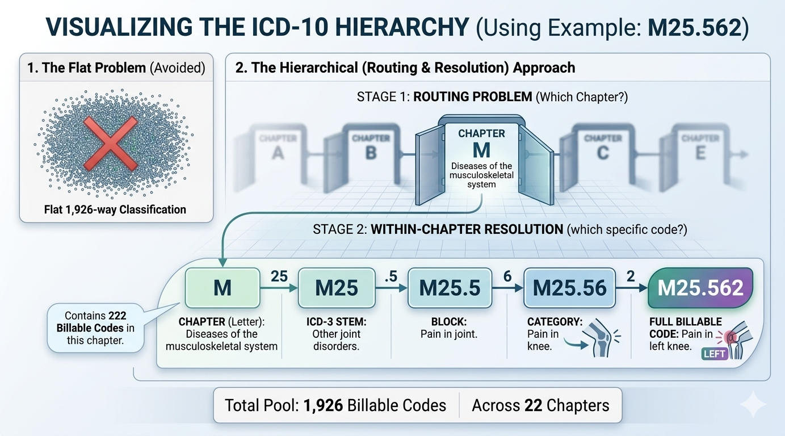

# Executive Summary

::: {.callout-tip icon=false}
## 🎯 The One-Paragraph Version

We built a system that reads clinical notes and automatically assigns the
correct ICD-10 diagnostic code — the billing and classification code that
describes a patient's condition. On a held-out test set of 966 records
covering 1,926 distinct codes, the system achieves **83.9% top-1 accuracy**
and automatically codes **82.1% of cases** at **95.2% precision**,
routing the remaining 17.9% to human review. It does this without access
to any real patient data, trained entirely on a high-quality synthetic dataset.
:::

---

## The Problem {#sec-exec-problem}

Every clinical encounter in a hospital or clinic generates a medical note.
For that encounter to be billed — whether to an insurer, a government
programme, or a patient — someone must translate the clinical language in
that note into a standardised diagnostic code from the ICD-10 classification
system maintained by the World Health Organisation.

There are **1,926 billable ICD-10 codes** in the scope of this project.
Assigning the right one requires clinical knowledge, familiarity with the
coding ruleset, and careful reading of often lengthy, unstructured free-text.
Today this work is performed manually by trained medical coders — a slow,
expensive, and error-prone process.

Coding errors and delays have real consequences:

- **Claim denials** — incorrect codes trigger automatic claim rejection by
  payers, costing providers revenue and administrative time.
- **Revenue cycle delays** — manual coding creates a bottleneck between care
  delivery and payment.
- **Data quality** — coding inconsistency degrades the quality of population
  health data, research datasets, and epidemiological surveillance.

Automated ICD-10 coding from clinical notes is one of the oldest and most
studied problems in clinical NLP. It remains unsolved at the scale of the
full ICD-10 code set.

---

## What We Built {#sec-exec-what}

The Notes-to-ICD-10 system is a two-stage hierarchical classification
pipeline built on top of `Bio_ClinicalBERT` — a version of BERT
pre-trained on clinical text from MIMIC-III.

{#fig-two-stage fig-alt="Diagram showing flat 1926-way classification avoided, replaced by Stage 1 chapter routing and Stage 2 within-chapter resolution using M25.562 as example"}

**Stage 1 — Chapter Router:** A 22-way classifier that reads the clinical
note and routes it to the correct ICD-10 chapter (the top level of the
hierarchy, identified by a single letter such as M for musculoskeletal or
Z for administrative contacts). This router achieves 98.7% accuracy — nearly
all notes are directed to the correct chapter.

**Stage 2 — Code Resolver:** Nineteen per-chapter classifiers that predict
the specific ICD-10 code within the routed chapter. Each resolver handles
between 12 and 263 codes. The resolvers are initialised from a flat ICD-10
classifier pre-trained for 40 epochs, which provides rich code representations
before chapter-specific fine-tuning begins.

**Confidence-gated output:** Every prediction comes with a calibrated
confidence score. Cases where the model is confident (≥0.7) are flagged
for automatic coding. Cases where the model is uncertain are routed to a
human coder for review. This selective automation strategy achieves high
precision on auto-coded cases without sacrificing recall.

---

## Key Results {#sec-exec-results}

```{python}
#| label: tbl-exec-leaderboard
#| tbl-cap: "🏆 Experiment leaderboard — all results on the same held-out test set of 966 records."

import json
import pandas as pd
from pathlib import Path
from IPython.display import display

# Load from registry if available, otherwise use documented values
results = [
    {"Experiment": "E-001 (ICD-3 flat baseline)", "Architecture": "Flat, 675 classes",
     "E2E Accuracy": "87.2%", "Macro F1": "0.841", "ECE": "—", "Coverage@0.7": "—",
     "Note": "ICD-3 codes only — not directly comparable"},
    {"Experiment": "E-002 (ICD-10 flat)", "Architecture": "Flat, 1,926 classes",
     "E2E Accuracy": "73.3%", "Macro F1": "0.634", "ECE": "—", "Coverage@0.7": "—",
     "Note": "Flat baseline"},
    {"Experiment": "E-003 (cold start)", "Architecture": "Hierarchical, no init",
     "E2E Accuracy": "11.1%", "Macro F1": "0.075", "ECE": "—", "Coverage@0.7": "—",
     "Note": "Architecture without warm init"},
    {"Experiment": "E-009 (20-epoch init)", "Architecture": "Hierarchical, E-002 init",
     "E2E Accuracy": "79.8%", "Macro F1": "0.711", "ECE": "—", "Coverage@0.7": "—",
     "Note": "20-epoch E-002 initialiser"},
    {"Experiment": "**E-010 (best)**", "Architecture": "Hierarchical, 40-epoch init",
     "E2E Accuracy": "**83.9%**", "Macro F1": "**0.762**", "ECE": "**0.034**",
     "Coverage@0.7": "**82.1%**", "Note": "Current best"},
]

df = pd.DataFrame(results)
from IPython.display import Markdown
display(Markdown(df.to_markdown(index=False)))
```

The three headline findings:

1. **Hierarchical architecture requires warm initialisation.** Without
   pre-trained encoder weights (E-003), the architecture collapses to 11.1%
   accuracy despite a near-perfect chapter router. With E-002 initialisation,
   it reaches 79.8%.

2. **Pre-training epoch count matters more than expected.** Doubling the
   E-002 pre-training from 20 to 40 epochs adds +4.1 percentage points
   E2E accuracy — a larger gain than any architectural change tested.

3. **Selective automation is viable.** At a 0.7 confidence threshold,
   82.1% of cases are auto-coded at 95.2% precision — a precision level
   that meets or exceeds typical human coding accuracy for common codes.

---

## What This Is Not {#sec-exec-not}

This system was developed and evaluated entirely on **MedSynth** — a
high-quality synthetic dataset of 10,240 clinical notes generated by GPT-4o
with balanced ICD-10 code coverage. It has **not** been validated on real
clinical notes from a live health system.

The performance figures in this document reflect the system's capability on
synthetic data with a uniform code distribution. Real clinical data has a
highly skewed distribution — common codes appear thousands of times, rare
codes appear once or twice — and may use clinical language, abbreviations,
and documentation styles that differ significantly from the synthetic notes.

Validation on MIMIC-IV-Note (real de-identified discharge summaries from
Beth Israel Deaconess Medical Center) is planned but currently blocked
pending PhysioNet data access approval.

::: {.callout-warning}
## Production Readiness
This system is a research prototype. It should not be used for live clinical
coding decisions without validation on real-world data from the target
health system.
:::

---

## Project at a Glance {#sec-exec-glance}

| | |
|---|---|
| **Dataset** | MedSynth — 9,660 billable records, 1,926 ICD-10 codes |
| **Model backbone** | `emilyalsentzer/Bio_ClinicalBERT` |
| **Architecture** | Two-stage hierarchical: 22-way router + 19 resolvers |
| **Training hardware** | Apple M5 Max (MPS acceleration) |
| **Total training time** | ~12 hours (full experiment chain) |
| **Best result** | 83.9% E2E accuracy, 0.762 Macro F1 |
| **Auto-coding rate** | 82.1% at 95.2% precision (τ = 0.7) |
| **Calibration quality** | ECE = 0.034 (well calibrated) |
| **Codebase** | Python 3.12, HuggingFace Transformers, Polars, uv |
| **Test coverage** | 94 unit tests, no GPU required |
