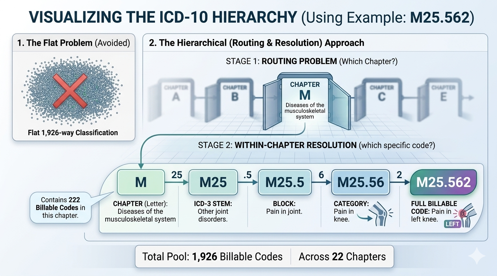

# Executive Summary

::: {.callout-tip icon=false}
## 🎯 The One-Paragraph Version

We built a system that reads clinical notes and automatically assigns the
correct ICD-10 diagnostic code — the billing and classification code that
describes a patient's condition — and then we discovered that our own
synthetic benchmark was **leaking the answer**. The diagnostic *descriptions*
left in the note text (e.g. "pain in left knee" for M25.562) let the model
read codes off the page rather than infer them. After removing that leakage,
headline accuracy on a held-out test set of 966 records fell from a reported
**86.7%** to a true **59.2%** — and, more strikingly, the corrected data
**reversed which model backbone is best**. The leaky benchmark ranked
ClinicalBERT first; on clean data, Clinical ModernBERT wins by ~18 points.
Our central finding is therefore a cautionary one: leaky synthetic benchmarks
do not merely inflate scores — they can invert architectural conclusions.
:::

---

## The Problem {#sec-exec-problem}

Every clinical encounter in a hospital or clinic generates a medical note.
For that encounter to be billed — whether to an insurer, a government
programme, or a patient — someone must translate the clinical language in
that note into a standardised diagnostic code from the ICD-10 classification
system maintained by the World Health Organisation.

There are **1,926 billable ICD-10 codes** in the scope of this project.
Assigning the right one requires clinical knowledge, familiarity with the
coding ruleset, and careful reading of often lengthy, unstructured free-text.
Today this work is performed manually by trained medical coders — a slow,
expensive, and error-prone process.

Coding errors and delays have real consequences:

- **Claim denials** — incorrect codes trigger automatic claim rejection by
  payers, costing providers revenue and administrative time.
- **Revenue cycle delays** — manual coding creates a bottleneck between care
  delivery and payment.
- **Data quality** — coding inconsistency degrades the quality of population
  health data, research datasets, and epidemiological surveillance.

Automated ICD-10 coding from clinical notes is one of the oldest and most
studied problems in clinical NLP. It remains unsolved at the scale of the
full ICD-10 code set.

---

## What We Built {#sec-exec-what}

The Notes-to-ICD-10 system is a two-stage hierarchical classification
pipeline built on top of `Bio_ClinicalBERT` — a version of BERT
pre-trained on clinical text from MIMIC-III.

{#fig-two-stage fig-alt="Diagram showing flat 1926-way classification avoided, replaced by Stage 1 chapter routing and Stage 2 within-chapter resolution using M25.562 as example"}

**Stage 1 — Chapter Router:** A 22-way classifier that reads the clinical
note and routes it to the correct ICD-10 chapter (the top level of the
hierarchy, identified by a single letter such as M for musculoskeletal or
Z for administrative contacts). On de-leaked data this router achieves 95.6%
accuracy — nearly all notes are directed to the correct chapter (chapter
routing is largely unaffected by leakage; the inflation was concentrated in
within-chapter code resolution).

**Stage 2 — Code Resolver:** Nineteen per-chapter classifiers that predict
the specific ICD-10 code within the routed chapter. Each resolver handles
between 12 and 263 codes. The resolvers are initialised from a flat ICD-10
classifier pre-trained for 40 epochs, which provides rich code representations
before chapter-specific fine-tuning begins.

**Confidence-gated output:** Every prediction comes with a calibrated
confidence score. Cases where the model is confident (≥0.7) are flagged
for automatic coding; uncertain cases are routed to a human coder. On
de-leaked data the best single model auto-codes 55.3% of cases at 83.7%
precision on covered cases — a more modest selective-automation profile than
the leaky figures implied, but the mechanism is intact.

---

## Key Results {#sec-exec-results}

```{python}
#| label: tbl-exec-leaderboard
#| tbl-cap: "Experiment leaderboard (de-leaked) — all results on the same content-addressed held-out test set of 966 records. The backbone ranking is reversed relative to the leaky benchmark."

import json
import pandas as pd
from pathlib import Path
from IPython.display import display

# Load from registry if available, otherwise use documented values
results = [
    {"Experiment": "E-021 ClinicalBERT (hier)", "Architecture": "Hierarchical, ClinicalBERT",
     "E2E Accuracy": "59.2%", "Macro F1": "0.477", "ECE": "0.088", "Coverage@0.7": "55.3%",
     "Note": "De-leaked headline (was 85.8% leaky)"},
    {"Experiment": "**E-024 Clinical ModernBERT**", "Architecture": "Hierarchical, Clinical ModernBERT",
     "E2E Accuracy": "**76.9%**", "Macro F1": "**0.672**", "ECE": "**0.039**", "Coverage@0.7": "**73.7%**",
     "Note": "**De-leaked BEST — beats ClinicalBERT by ~18pp**"},
    {"Experiment": "E-026 BioClinical ModernBERT", "Architecture": "Hierarchical, BioClinical ModernBERT",
     "E2E Accuracy": "39.8%", "Macro F1": "0.289", "ECE": "0.049", "Coverage@0.7": "18.3%",
     "Note": "De-leaked (was 7.0% leaky — also inflated downward by leakage)"},
    {"Experiment": "E-022 ClinicalBERT + SupCon Z", "Architecture": "Hierarchical + SupCon Z",
     "E2E Accuracy": "59.7%", "Macro F1": "—", "ECE": "0.089", "Coverage@0.7": "56.1%",
     "Note": "SupCon adds +0.5pp de-leaked (was +0.9 / '+21.2pp on Z' leaky)"},
    {"Experiment": "MIMIC-IV validation", "Architecture": "E-021 on real notes",
     "E2E Accuracy": "8.1%", "Macro F1": "0.042", "ECE": "0.318", "Coverage@0.7": "20.2%",
     "Note": "Real discharge summaries — domain shift dominates (was 12.0%)"},
]

df = pd.DataFrame(results)
from IPython.display import Markdown
display(Markdown(df.to_markdown(index=False)))
```

The four headline findings (all numbers on de-leaked data):

1. **Description leakage inflated the headline by ~30% relative.** The
   certified redaction that produced our gold data stripped ICD-10 *codes*
   from the note text but left human-readable *descriptions* in place. The
   model learned to read those descriptions rather than reason from clinical
   findings. Removing the leakage drops ClinicalBERT's hierarchical E2E from
   a reported **85.8% to 59.2%** — a 25.7-point fall (~30% relative).

2. **Leakage inverted the backbone ranking — the central result.** On the
   leaky benchmark, ClinicalBERT (85.8%) appeared to beat Clinical ModernBERT
   (48.8%) decisively, and we had concluded "domain pretraining beats
   architectural modernity." On de-leaked data the order **reverses**:
   Clinical ModernBERT reaches **76.9%**, beating ClinicalBERT's 59.2% by
   ~18 points, and does so *uniformly* — winning 17 of 19 chapters. The leaky
   signal was so strong that the older model exploited it best; once removed,
   the more modern architecture's genuine advantage emerges. **A leaky
   benchmark ranked the backbones backwards.**

3. **The "SupCon solves the Z chapter" result was ~97% artifact.** Supervised
   Contrastive Learning appeared to lift the administrative Z-chapter by
   +21.2pp (62.1%→83.3%) and the system to 86.7%. De-leaked, the genuine
   effect is a ~6pp gain on the Z resolver's validation accuracy that nearly
   vanishes at the system level (+0.5pp, 59.2%→59.7%). The dramatic leaky
   gain was leakage, not contrastive learning.

4. **Neither model generalises to real notes.** On 4,877 real MIMIC-IV
   discharge summaries the de-leaked system scores **8.1%** E2E (the leaky
   model scored 12.0%). Both collapse to near-floor; the synthetic-to-real
   gap is driven by domain shift and is largely independent of leakage.

### Architecture lessons (from development)

These structural findings emerged during development on the leaky benchmark.
Their *numbers* are leaky-regime and not directly comparable to the de-leaked
figures above, but the qualitative lessons about the architecture stand:

5. **The hierarchical architecture requires warm initialisation.** Without
   pre-trained encoder weights, the two-stage architecture collapsed
   (~11% E2E, leaky regime) despite a near-perfect chapter router — the
   Stage-2 resolvers cannot learn from scratch on limited per-chapter data.
   Initialising them from a flat ICD-10 classifier was necessary for the
   architecture to work at all.

6. **Confidence-gated selective automation is viable in principle.** The
   calibrated-confidence gating mechanism cleanly separates auto-codeable
   from review-needed cases at a chosen threshold; the de-leaked operating
   point (55.3% coverage at 83.7% precision on covered, finding 1) is more
   modest than the leaky figures suggested, but the mechanism itself is sound.

---

## What This Is Not {#sec-exec-not}

This system was developed and evaluated entirely on **MedSynth** — a
high-quality synthetic dataset of 10,240 clinical notes generated by GPT-4o
with balanced ICD-10 code coverage. It has **not** been validated on real
clinical notes from a live health system.

The performance figures in this document reflect the system's capability on
synthetic data with a uniform code distribution. Real clinical data has a
highly skewed distribution — common codes appear thousands of times, rare
codes appear once or twice — and may use clinical language, abbreviations,
and documentation styles that differ significantly from the synthetic notes.

Validation on MIMIC-IV-Note (real de-identified discharge summaries from
Beth Israel Deaconess Medical Center) is planned but currently blocked
pending PhysioNet data access approval.

::: {.callout-warning}
## Production Readiness
This system is a research prototype. It should not be used for live clinical
coding decisions without validation on real-world data from the target
health system.
:::

---

## Project at a Glance {#sec-exec-glance}

| | |
|---|---|
| **Dataset** | MedSynth — 9,660 billable records, 1,926 ICD-10 codes |
| **Best backbone (de-leaked)** | `Simonlee711/Clinical_ModernBERT` (ClinicalBERT was the leaky-regime winner) |
| **Architecture** | Two-stage hierarchical: 22-way router + 19 resolvers |
| **Training hardware** | Apple M5 Max (MPS acceleration) |
| **Total training time** | ~12 hours (full experiment chain) |
| **Best result (de-leaked)** | Clinical ModernBERT 76.9% E2E, 0.672 Macro F1 |
| **Auto-coding rate (de-leaked)** | 55.3% at 83.7% precision on covered (τ = 0.7) |
| **Calibration quality (de-leaked)** | ECE = 0.088 (ClinicalBERT) / 0.039 (ModernBERT) |
| **Codebase** | Python 3.12, HuggingFace Transformers, Polars, uv |
| **Test coverage** | 170 unit tests, no GPU required |
| **Backbone evaluation (de-leaked)** | ModernBERT 76.9% > ClinicalBERT 59.2% > BioClinical 39.8% — ranking REVERSED vs leaky |
| **Z-chapter SupCon (de-leaked)** | +0.5pp system (the leaky +21.2pp was artifact) |
| **MIMIC-IV validation (de-leaked)** | 8.1% real-world E2E — domain shift dominates |
