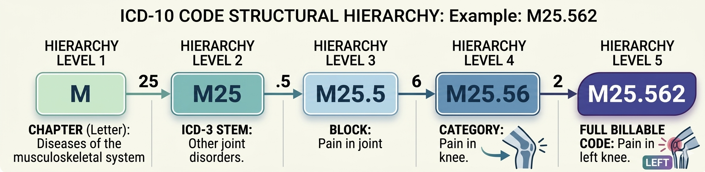

# Introduction

::: {.callout-note icon=false}
## Plain-Language Summary
ICD-10 coding is the process of translating a clinical note into a
standardised diagnostic code used for billing and record-keeping. It is
currently done by hand, which is slow and error-prone. This project builds
a machine learning system to automate it. This section explains the problem,
the coding standard, and why it is technically difficult.
:::

---

## Clinical Coding: The Problem Domain {#sec-intro-domain}

When a patient sees a physician, the encounter generates clinical
documentation — a note describing the patient's complaint, the examination
findings, the physician's assessment, and the treatment plan. For that
encounter to be reimbursed by an insurer or government health programme,
the documented diagnoses must be translated into standardised codes from the
**International Classification of Diseases, 10th Revision** (ICD-10), maintained
by the World Health Organisation and adapted for clinical use by national
health authorities.

In practice this translation — called **clinical coding** or **medical coding** —
is performed by trained specialists who read the note and assign one or more
ICD-10 codes that accurately reflect the documented conditions. The process
is:

- **Time-consuming** — a coder may handle 20-40 complex records per day.
- **Expensive** — medical coding is a specialised profession requiring
  certification and ongoing training.
- **Error-prone** — coding accuracy studies consistently report error rates
  of 10-30% even among experienced coders [@OHara2021; @Becker2021].
- **Delayed** — the lag between care delivery and code assignment creates
  revenue cycle friction and delays population health reporting.

The automation of clinical coding has been an active research area since the
1990s [@Larkey1996], but remains an unsolved problem at the scale and
specificity of the full ICD-10 code set.

---

## The ICD-10 Hierarchy {#sec-intro-hierarchy}

ICD-10 codes have a hierarchical structure that this project exploits
directly. @fig-icd10-hierarchy illustrates the five levels using the
code `M25.562` (Pain in left knee) as a concrete example.

{#fig-icd10-hierarchy fig-alt="ICD-10 hierarchy diagram showing M to M25 to M25.5 to M25.56 to M25.562"}

The full billable code space in this project comprises **1,926 codes** across
**22 chapters**. The distribution across chapters is highly uneven — the
musculoskeletal chapter (M) contains 222 codes while the infection chapter
(A) contains only 12 codes in this dataset's scope.

Understanding this hierarchy is central to the system architecture: rather
than treating ICD-10 prediction as a flat 1,926-way classification problem,
we decompose it into a routing problem (which chapter?) followed by a
within-chapter resolution problem (which specific code?).

---

## Why This Is Hard {#sec-intro-hard}

Automated ICD-10 coding from clinical text is a challenging NLP problem
for several compounding reasons.

**Extreme label space.** With 1,926 billable codes in scope (and over 70,000
in the full ICD-10 system), even a well-trained model faces a classification
problem where many classes have very few training examples. This project's
dataset contains approximately **5 training examples per code** — a regime
where any model must generalise aggressively from limited signal.

**Code similarity and confusability.** Many ICD-10 codes describe conditions
that are clinically similar and documented using nearly identical language.
The Z-chapter (administrative contacts and factors influencing health) is
a particular challenge: it contains 263 codes covering screening visits,
preventive care, and follow-up encounters that often produce nearly
indistinguishable clinical notes.

**Note length and structure variability.** Clinical notes vary enormously in
length (this project's dataset contains notes ranging from under 100 words
to over 1,300 words) and in how they are structured. The 512-token context
window of BERT-based models means that longer notes are silently truncated —
content beyond approximately 400 words may be lost.

**Label leakage risk.** Clinical notes sometimes contain the ICD-10 code
itself, either because the electronic health record system auto-populates it
or because the physician explicitly documents it. A model that learns to
detect these instances rather than the underlying clinical signal would
achieve artificially high accuracy on synthetic data but fail on real notes
where this pattern may not hold.

**Synthetic-to-real generalisation gap.** Training on synthetic data — as
this project does — introduces a domain shift risk. The linguistic patterns
in GPT-4o-generated notes may differ systematically from real clinical
documentation, potentially overstating performance on the target task.

---

## Project Objectives {#sec-intro-objectives}

This project has three objectives, in priority order:

1. **Demonstrate that hierarchical decomposition improves ICD-10 prediction
   accuracy over flat classification** when operating at the scale of the
   full billable code set.

2. **Identify the key factors that determine whether hierarchical
   decomposition succeeds or fails** — specifically the role of
   initialisation strategy and pre-training depth.

3. **Build a well-engineered, reproducible research codebase** that can
   serve as a foundation for future work on real clinical data once
   MIMIC-IV-Note access is obtained.

These objectives are narrower than a production deployment goal. The system
is a research prototype built to advance understanding of the problem, not
a clinical tool ready for deployment.

---

## Scope and Constraints {#sec-intro-scope}

The following explicit constraints shaped all design decisions in this project:

- **Single diagnosis per note.** Each note in the MedSynth dataset is
  associated with exactly one ICD-10 code. Real clinical encounters often
  have multiple diagnoses — multi-label prediction is a natural extension
  but is outside the current scope.

- **Billable codes only.** The project targets the 1,926 billable ICD-10
  codes present in the dataset, excluding placeholder codes, codes with
  insufficient specificity, and codes that are valid only in combination
  with others.

- **No real patient data.** All development, training, and evaluation uses
  the MedSynth synthetic dataset. Validation on real clinical data (MIMIC-IV)
  is planned but pending data access approval.

- **Single-GPU training on consumer hardware.** All training was conducted
  on an Apple M5 Max using Metal Performance Shaders (MPS) acceleration —
  no cloud GPU compute was used.

---

## Organisation of This Document {#sec-intro-organisation}

The remainder of this document is organised as follows:

- **Chapter 3 (Dataset)** describes the MedSynth dataset, the APSO-Flip
  preprocessing strategy, and the ICD-10 label validation pipeline.

- **Chapter 4 (Methodology)** describes the model architecture, training
  strategy, and calibration approach in full technical detail.

- **Chapter 5 (Experiments)** documents the experimental progression from
  the initial flat baseline through to the best hierarchical result.

- **Chapter 6 (Results)** presents the final evaluation metrics with
  per-chapter breakdown and confidence calibration analysis.

- **Chapter 7 (Inference Pipeline)** describes the production-ready
  inference system including input validation, preprocessing, and
  confidence-gated output.

- **Chapter 8 (Limitations)** provides an honest assessment of what the
  current system cannot do and where it may fail.

- **Chapter 9 (Conclusions)** summarises the key findings and proposes
  directions for future work.
